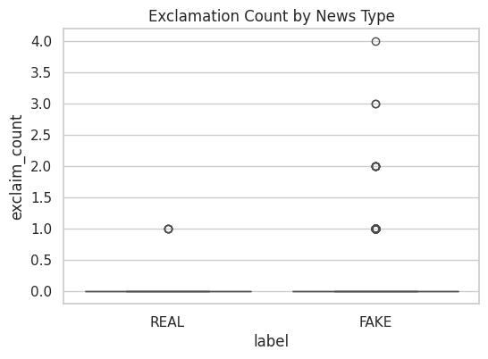
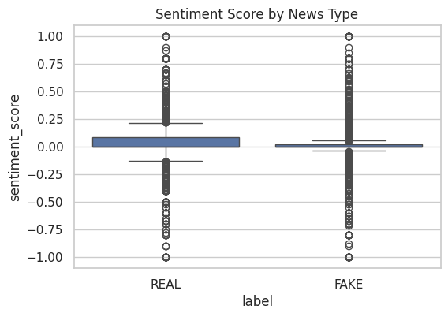
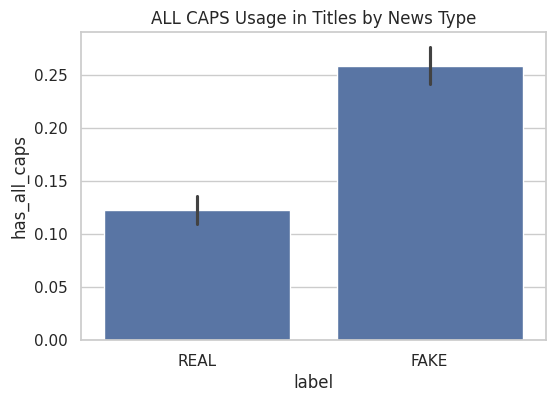

# 🧠 Fake News Forensics: Headline-Based Detection Using Linguistic Signals

A forensic machine learning project that detects fake political news using **only the headline text** — leveraging emotional and structural patterns like exclamations, all-caps, and sentiment polarity.  
This project demonstrates how lightweight NLP features can rival complex models when engineered with intention.

---

## 🚀 Why This Project Stands Out

- ⚔️ **Headline-only classification** — no article body needed
- 🔍 **Hand-crafted linguistic features** (not just pre-trained embeddings)
- 📈 Achieves ~80% accuracy using **Logistic Regression**
- 📊 Visual analytics included (sentiment, exclamation, caps usage)
- 🤖 Includes real-time headline prediction with a custom function

---

## 🛠 Features Engineered

| Feature | Description |
|--------|-------------|
| `title_length` | Total number of characters in the headline |
| `exclaim_count` | Number of exclamation marks (!) |
| `has_all_caps` | Boolean: contains ALL CAPS word(s) |
| `sentiment_score` | Polarity score using TextBlob sentiment |

These were selected for their ability to capture **drama, intensity, and emotional manipulation** often present in fake news.

---

## 📊 Visual Insights

### 📈 Exclamation Mark Distribution


### 📉 Sentiment Score by News Type


### 🔊 ALL CAPS Usage


- Fake headlines show **higher exclamation counts**
- They tend to have **stronger sentiment polarity**
- Use of **ALL CAPS** is disproportionately higher in fake titles

## 🔮 Model Details

| Component | Technique |
|----------|-----------|
| Feature Engineering | Rule-based NLP (TextBlob, regex) |
| Model | Logistic Regression |
| Accuracy | ~80% |
| Input | Headline text only |
| Output | Binary: FAKE / REAL |

---

## 💡 Real-Time Prediction Function

```python
predict_headline("BREAKING: VACCINE LINKED TO MIND CONTROL EXPERIMENTS!")
# Output: FAKE
